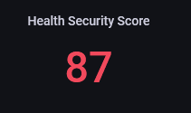
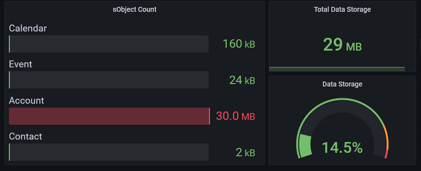
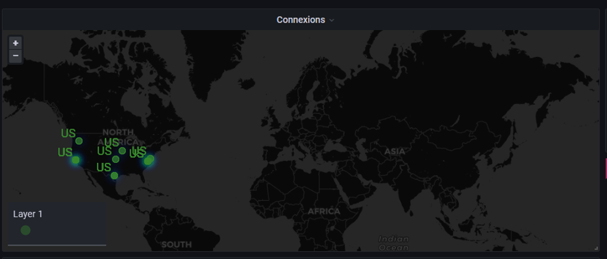
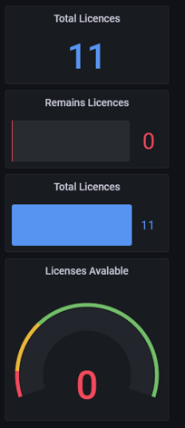
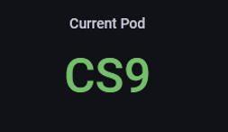
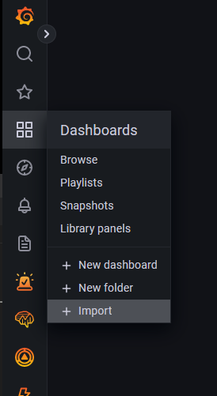

# Grafana monitoring for salesforce

This project is an exemple of implementation of Grafana to monitor multiple element of a salesforce environement. 
It could be used with free tool (Grafana cloud, Github Action and Influx DB) but you are free to use other ones.


<br /><br />

## Monitoring element

- ### SecurityHealthCheck




- ### Limit API calls over time


- ### Evolution of storage




- ### Geolocation of users



 
- ### Count of licenses available




- ### Life cycle of the pod





## Deployment

To deploy this project run

### 1. Salesforce

You just need technical user with the according permission set to access API used in the scripts
<br /><br />

### 2. Github Action

You can use the script in the github/workflows folder. You will have to create environement variables in

 ``` Setting -> Secrets -> Action ```

- InfluxDB related

```INF_BUCKET```: the name of the bucket you used to store records

```INF_ORG``` : exemple: 5cd0450c43c57af1 

```INF_TOKEN``` exemple: rQeLw8V2f7GN3xr-0ndZjRZPHkT7hPghkG6fQKyDEwa6eexgQw-gVorRc_eOcu7biTiij7GW

```INF_URL``` exemple: "https:// eu-central-1-1.aws.cloud2.influxdata.com"

- Salesforce related

```SF_CONSUMER_KEY```

```SF_CONSUMER_SECRET```

```SF_PASSWORD```

```SF_TOKEN```

```SF_USERNAME```
<br /><br />

### 3. Influx DB

Get an account on https://cloud2.influxdata.com/signup (with a google account)

- Create a bucket from the data explorer


- Go to Load Data => Influx CLI and folow the instruction. 


- Store the credentials of your instance in the github action  ``` Setting -> Secrets -> Action ```
<br /><br />


### 4. Grafana

Sign-up for an account on grafana cloud https://grafana.com/auth/sign-up/create-user?plcmt=sub-nav

#### Set up the connection with Influx DB

```Configuration => Data source => Add data source => choose Influx DB```


```Query Language```: Flux

```URL```: put the url of you influxDB instance eg "https:// eu-central-1-1.aws.cloud2.influxdata.com"

Unselect Basic auth

```Organisation```: the account email address you use to create the influxDB instance

```Token```: the token of your bucket 

```Default Bucket```: the bucket where you store values 

You can now import the dashboard_grafana.json or create your own dashboard based on what you want




